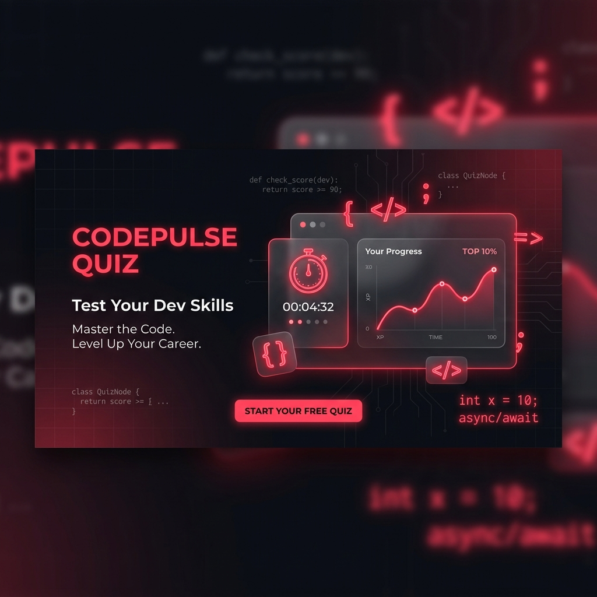

<div align="center">
  

  # 🏆 KBSQUIZ

  *A lightning-fast, static frontend MCQ platform built natively with pure HTML, CSS, and JS.*

</div>

## 🚀 Overview

KBSQUIZ is a premier, fully client-side Quiz application primarily purposed for software developers. Test your limits across **Programming Languages, Frameworks, Developer Tools, and Aptitude** with instant performance tracking, dynamically timed exams, and highly detailed mock analytics, all without ever needing a backend database.

## ✨ Key Features

- **⚡ Zero Server Dependency**: 100% fast, local, and static Vanilla Javascript execution.
- **📚 35+ Developer Subjects**: From JavaScript and React to Docker and SQL, master the exact tools used in the software industry.
- **⏱️ Advanced Simulators**: Choose between infinite upward-tracking Practice runs, dynamic 1-minute-per-question Timed modes, or strict Mock exams.
- **🎨 Premium UI Framework**: A deeply integrated Dark & Light mode toggle, sleek transitions, and a custom-built premium CSS aesthetic natively without external libraries.
- **📊 Analytics Dashboard**: Track your exact test history, subject-by-subject hit rates, and total elapsed test time seamlessly.

## 🛠️ Technology Stack

- **HTML5** for semantic, lightweight page structure.
- **CSS3** with dynamic custom root variable mapping for modern, modular styling.
- **Vanilla JavaScript** powering complex quiz arrays, real-time timer tracking, and an extensive custom virtual page router.

## 🏃‍♀️ Running Locally

Because the project is entirely statically built, getting started is completely frictionless!

1. Clone this repository to your local machine:
   ```bash
   git clone https://github.com/bablukumar-/KBSQUIZ.git
   ```
2. Simply double-click and open the robust `index.html` file in your favorite web browser. 

## 📬 Connect

Interested in collaborating or just want to chat? Reach out to me!
- 👤 **Author**: Bablu Sarkar (Rahul Sharma demo logic replaced directly)
- 📧 **Email**: bablu.devs.ai@gmail.com
- 🌐 **LinkedIn**: [Bablu Sarkar](https://www.linkedin.com/in/bablu-sarkar-5a48b7282/)
- 💻 **GitHub**: [@bablukumar-](https://github.com/bablukumar-)
- 📱 **Facebook**: [Bablu Sarkar](https://www.facebook.com/ji.sarkar.ji.420153/)

---
*&copy; 2026 KBSQUIZ natively built. No databases harmed.*
